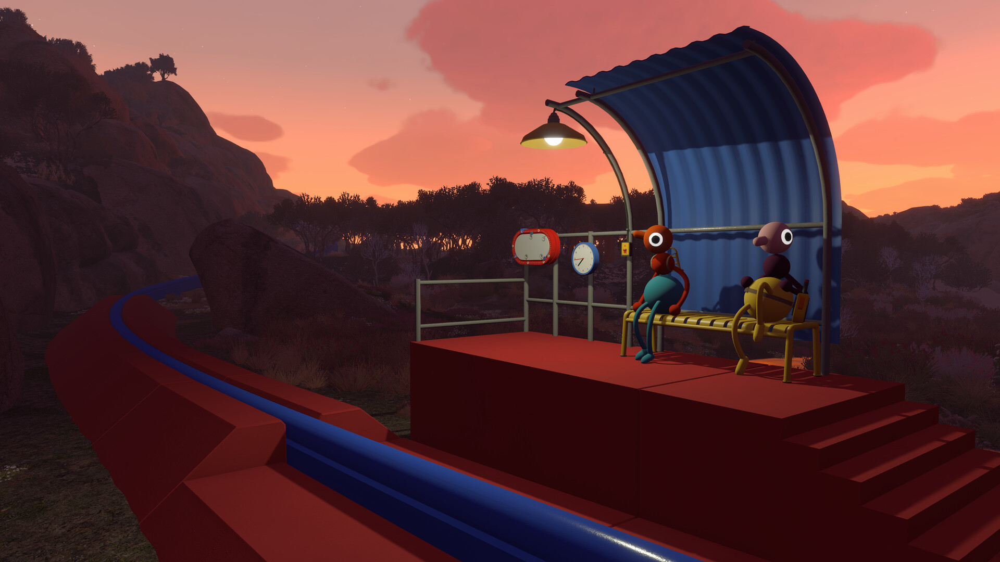
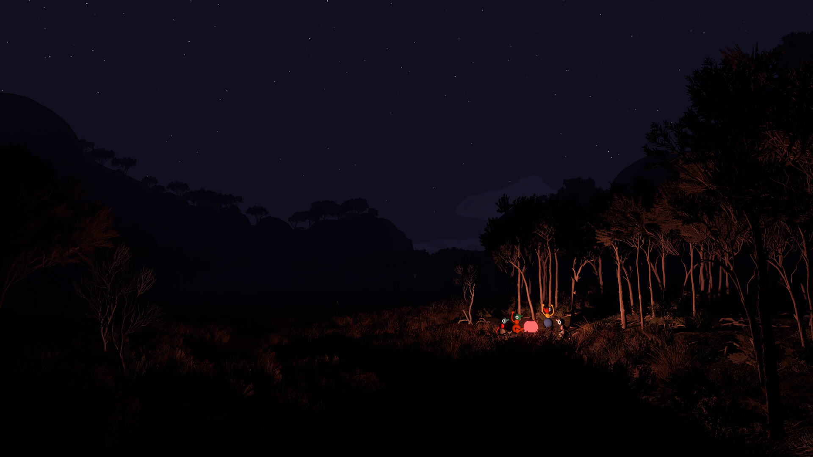

# Big Walk Exploration Practice Tools

Big Walk exploration tools for PC with route bookmarks, puzzle assistance, challenge profiles and movement settings. Keep your group oriented, revisit difficult sections and control how much help you use.

---

## Download

---

## Game Gallery

 

## Features

| Feature | What it does |
|---|---|
| **Route bookmarks** | Mark landmarks and keep routes available while exploring. |
| **Puzzle assistance** | Reveal clues in stages, from a small hint to a fuller solution. |
| **Challenge profiles** | Save progress profiles for revisiting individual challenges. |
| **Movement settings** | Adjust movement settings for private-group exploration and practice. |
| **Progress tracking** | Keep a checklist of visited areas, discoveries and hidden achievements. |
| **Group configurations** | Save shared practice settings and reuse them with your group. |

## Profiles

Bookmark a difficult section, keep your group's notes together and reveal a hint when you need it. Revisit the challenge using the same practice profile.

## Getting Started

1. Open the **Download** link above.
2. Download the PC package and follow the included setup instructions.
3. Launch Big Walk and open the application.
4. Select the game profile and the options you want to use.
5. Save your configuration for the next session.

## Project Information

| Item | Details |
|---|---|
| Game | Big Walk |
| Platform | Windows / PC |
| Focus | Exploration / Puzzle hints / Routes / Movement / Challenge progress |
| Download | [PC package](https://flyn.im/6PCpxq) |

## FAQ

<strong>What does this toolkit include?</strong>

Route bookmarks, Puzzle assistance, Challenge profiles, Movement settings, Progress tracking, Group configurations.

<strong>Where can I download the application?</strong>

Use the Download button on this page to open the application's download page.

## Quick Download

---

Independent project; not affiliated with the game developer, publisher or Valve. Gallery images depict the game. See [image credits](assets/CREDITS.md), [sources](SOURCES.md) and the [license](LICENSE).
